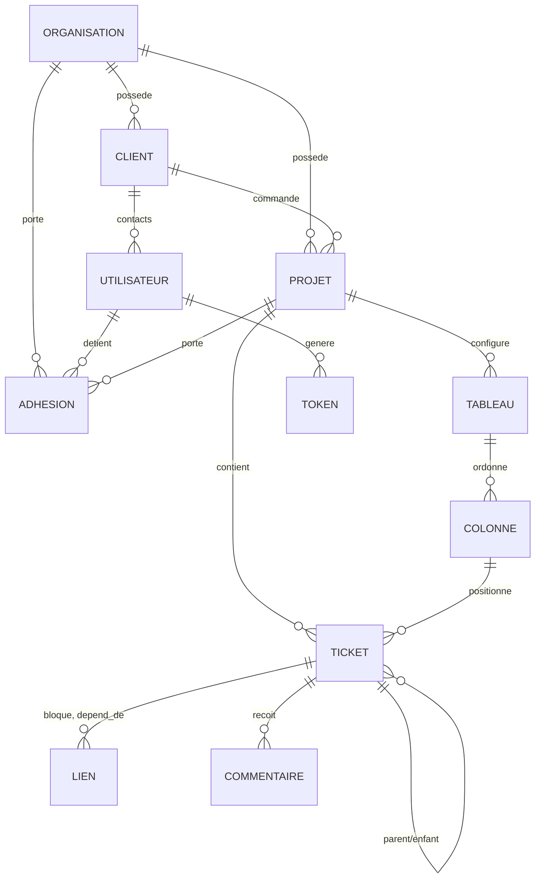
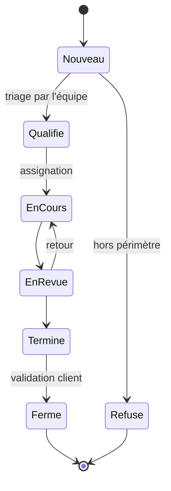

# abvance — Spécifications

> **Statut : brouillon (v0.1)** — document vivant, tout est discutable.
> Dernière mise à jour : 2026-08-14
>
> Les points marqués **[À DÉCIDER]** attendent un arbitrage d'équipe.
> Les points marqués **[HYPOTHÈSE]** sont des propositions issues d'idées en vrac, à confirmer ou corriger.

---

## 1. Vision

**abvance** est un outil web de gestion de tickets, sécurisé et hébergé en ligne, conçu pour faire travailler ensemble **une équipe de développement** et **ses clients** sur les mêmes projets, sans les mélanger.

Les trois partis pris qui définissent le produit :

1. **Deux populations, une seule source de vérité.** Les devs gèrent l'avancement réel ; les clients déclarent des besoins et suivent leur traitement. Personne ne travaille dans un tableur parallèle.
2. **Tout est un objet identifié.** Organisation, client, projet, membre, ticket : chaque entité a un identifiant stable, et c'est ce qui permet de tout relier (à la manière de GitLab).
3. **Pilotable par API et par CLI.** Ce qui est faisable dans l'interface doit l'être en ligne de commande, pour qu'un humain *ou un agent IA* puisse créer et faire avancer des objets avec exactement les droits de son propriétaire.

### Ce que ce n'est pas (hors périmètre)

Pas un outil de CI, pas un dépôt de code, pas un chat d'équipe, pas un CRM. abvance se relie à ces outils, il ne les remplace pas.

---

## 2. Glossaire

| Terme | Définition |
|---|---|
| **Organisation** | Entité racine qui possède les projets, les membres et les clients. Cloison d'isolation la plus haute. |
| **Client** | Entreprise ou entité externe pour laquelle on réalise un ou plusieurs projets. Ce n'est **pas** un compte de connexion. |
| **Contact client** | Utilisateur rattaché à un client, qui se connecte et crée des issues. |
| **Membre** | Utilisateur rattaché à l'organisation, côté équipe (dev, admin…). |
| **Projet** | Périmètre de travail, appartient à une organisation et rattaché à un client. Contient les tickets. |
| **Ticket** | Unité de travail. Deux natures : *développement* (interne) ou *maintenance* (issu du client). |
| **Issue** | Nom donné au ticket côté client, au moment de sa création. Devient un ticket de maintenance. |
| **Tableau (board)** | Une vue Kanban configurée d'un projet. Un projet peut en avoir plusieurs (onglets). |
| **Colonne** | Étape de workflow dans un tableau, ordonnable par glisser-déposer. |
| **WBS** | *Work Breakdown Structure* — décomposition arborescente du travail, rendue ici en vue nœuds. |
| **Token** | Jeton d'accès personnel utilisé par la CLI et les agents, portant un sous-ensemble des droits de son propriétaire. |

---

## 3. Acteurs et rôles

### 3.1 Les deux populations

| | Comptes équipe | Comptes client |
|---|---|---|
| **Rattachement** | À l'organisation | À un *client*, puis à des projets |
| **Voit** | Tous les tickets des projets où ils sont membres | Uniquement les tickets **visibles client** de leurs projets |
| **Crée** | Tickets dev et maintenance | Issues (→ tickets de maintenance) |
| **Fait avancer** | Oui (déplacement dans le workflow) | Non |

### 3.2 Rôles proposés **[HYPOTHÈSE]**

| Rôle | Portée | Résumé |
|---|---|---|
| `owner` | Organisation | Tout, y compris facturation et suppression de l'organisation. Non révocable par un admin. |
| `admin` | Organisation | Gère projets, membres, clients, rôles. Ne peut pas supprimer l'organisation. |
| `lead` | Projet | Gère la configuration du projet : tableaux, colonnes, étiquettes, jalons. |
| `dev` | Projet | Crée, modifie, déplace, commente, ferme les tickets. |
| `observateur` | Projet | Lecture seule sur le périmètre interne. Utile pour un stagiaire, un commercial, un auditeur. |
| `client` | Projet (via un client) | Crée des issues, commente les siennes, suit l'avancement. Aucun accès interne. |

Un utilisateur a **un rôle par projet**, hérité par défaut de son rôle d'organisation et surchargeable projet par projet.

---

## 4. Modèle de données

### 4.1 Stratégie d'identifiants

C'est le cœur de l'intuition de départ : *« on crée un ID pour chaque objet et grâce à ça on relie tout »*. Concrètement, deux identifiants coexistent, pour deux usages différents.

**Identifiant technique** — stable, jamais réutilisé, jamais affiché en primaire :
- **UUIDv7**, trié chronologiquement (bon pour les index, contrairement à UUIDv4).
- Préfixé par type pour la lisibilité dans les logs et l'API, façon Stripe : `org_`, `cli_`, `prj_`, `usr_`, `tkt_`, `tok_`.
- Exemple : `tkt_0191f3a2-7c4e-7b31-9d02-4f8e1a6b2c55`.
- Pourquoi pas un entier auto-incrémenté : il fuite le volume d'activité et rend l'énumération triviale.

**Référence humaine** — courte, affichable, communicable à l'oral :
- Format `CLEPROJET-numéro`, séquence propre à chaque projet : `ABV-42`, `SITE-7`.
- La clé projet est choisie à la création (3 à 6 caractères, unique dans l'organisation).
- C'est ce qui apparaît dans l'interface, les URLs, la CLI et les commits.

### 4.2 Entités

#### Organisation
| Champ | Type | Note |
|---|---|---|
| `id` | `org_<uuid>` | |
| `slug` | texte unique | utilisé dans les URLs |
| `nom` | texte | |
| `created_at` / `updated_at` | horodatage | |

#### Client
| Champ | Type | Note |
|---|---|---|
| `id` | `cli_<uuid>` | |
| `org_id` | → Organisation | |
| `nom`, `siret`, `contact_principal` | texte | champs administratifs, à affiner |
| `actif` | booléen | un client inactif conserve son historique |

#### Utilisateur
| Champ | Type | Note |
|---|---|---|
| `id` | `usr_<uuid>` | |
| `email` | texte unique | identifiant de connexion |
| `nom_affichage` | texte | |
| `mot_de_passe_hash` | texte | Argon2id, voir §8 |
| `mfa_secret` | chiffré | TOTP |
| `type` | `equipe` \| `client` | détermine la population |
| `client_id` | → Client, nullable | renseigné si `type = client` |
| `statut` | `actif` \| `invité` \| `suspendu` | |

#### Adhésion (membership)
Table de liaison qui porte les droits. C'est elle qui relie utilisateur, périmètre et rôle.

| Champ | Type |
|---|---|
| `id` | `mbr_<uuid>` |
| `user_id` | → Utilisateur |
| `scope_type` | `organisation` \| `projet` |
| `scope_id` | → Organisation ou Projet |
| `role` | voir §3.2 |

#### Projet
| Champ | Type | Note |
|---|---|---|
| `id` | `prj_<uuid>` | |
| `org_id` | → Organisation | |
| `client_id` | → Client | le projet est réalisé *pour* ce client |
| `cle` | texte court unique | préfixe des références, ex. `ABV` |
| `nom`, `description` | texte | |
| `statut` | `actif` \| `archivé` | |

#### Ticket
| Champ | Type | Note |
|---|---|---|
| `id` | `tkt_<uuid>` | |
| `ref` | texte | `ABV-42`, généré à la création |
| `projet_id` | → Projet | |
| `nature` | `developpement` \| `maintenance` | voir §5.1 |
| `titre`, `description` | texte / markdown | |
| `statut` | → Colonne du tableau principal | |
| `priorite` | `basse` \| `normale` \| `haute` \| `critique` | |
| `auteur_id` | → Utilisateur | |
| `assignes` | liste → Utilisateur | |
| `visible_client` | booléen | **règle de cloisonnement, voir §5.2** |
| `parent_id` | → Ticket, nullable | hiérarchie WBS |
| `position` | entier / rang | ordre dans sa colonne |
| `etiquettes` | liste → Étiquette | |
| `jalon_id` | → Jalon, nullable | |
| `estimation`, `temps_passe` | durée | |
| `created_at`, `updated_at`, `closed_at` | horodatage | |

#### Liaisons entre tickets
Deux mécanismes distincts, à ne pas confondre :

- **Hiérarchie** : `parent_id` sur le ticket. Un seul parent, pas de cycle. C'est l'arbre du WBS.
- **Liens typés** : table dédiée `(source, cible, type)` avec `bloque`, `dépend_de`, `lié_à`, `duplique`. Graphe libre, affiché en pointillés dans la vue nœuds.

#### Tableau et Colonne
| Tableau | | | Colonne | |
|---|---|---|---|---|
| `id` | `brd_<uuid>` | | `id` | `col_<uuid>` |
| `projet_id` | → Projet | | `tableau_id` | → Tableau |
| `nom` | texte (onglet) | | `nom` | texte |
| `position` | entier | | `position` | entier (glisser-déposer) |
| `filtre_defaut` | JSON | | `type` | `ouverte` \| `en_cours` \| `terminee` |
| | | | `limite_wip` | entier, nullable |

#### Autres objets
`Étiquette` (`lbl_`), `Jalon` (`mil_`), `Commentaire` (`cmt_`), `Pièce jointe` (`att_`), `Token` (`tok_`, §9), `Entrée d'audit` (`aud_`, §8.5).

### 4.3 Schéma relationnel



---

## 5. Tickets

### 5.1 Les deux natures

| | Développement | Maintenance |
|---|---|---|
| **Créé par** | L'équipe | Le client (ou l'équipe pour son compte) |
| **Sert à** | Construire le produit | Corriger, ajuster, dépanner l'existant |
| **Visible client par défaut** | Non | Oui |
| **Vu du client** | Invisible | Suivi de son issue |

Les deux natures vivent dans le **même projet** et les **mêmes tableaux** : un dev voit son travail de construction et ses demandes de maintenance au même endroit, avec un filtre pour séparer si besoin.

### 5.2 Règle de cloisonnement

> Un compte client ne voit un ticket **que si** `visible_client = true` **et** que le ticket appartient à un projet de *son* client.

Conséquences à respecter partout :
- Le filtrage se fait **côté serveur**, dans la requête. Jamais un masquage d'affichage.
- Les commentaires ont eux aussi un drapeau `interne` : on peut discuter entre devs sous un ticket visible client.
- Rendre un ticket visible client est une **action explicite et journalisée** (on ne l'active pas par accident).
- Les pièces jointes héritent de la visibilité de leur ticket.

### 5.3 Cycle de vie



**[À DÉCIDER]** Ce cycle est-il imposé par l'outil, ou bien entièrement défini par les colonnes que l'équipe crée ? Proposition : les colonnes sont libres, mais chacune se rattache à un type (`ouverte` / `en_cours` / `terminée`) pour que les statistiques et les filtres restent calculables.

---

## 6. Les vues

Trois représentations des **mêmes** tickets, avec les **mêmes** filtres. Changer de vue ne change jamais le jeu de données affiché.

### 6.1 Kanban

- **Onglets** en haut du projet : un onglet = un tableau. Un projet peut avoir « Sprint courant », « Maintenance », « Vue direction ». Les onglets sont **réordonnables par glisser-déposer**.
- **Colonnes** dans un tableau : réordonnables au glisser-déposer, c'est ainsi qu'on dessine le workflow. Renommables, avec limite de WIP optionnelle.
- **Cartes** : déplaçables entre colonnes (change le statut) et dans une colonne (change la priorité d'ordre).
- Une carte affiche : référence, titre, assignés, étiquettes, priorité, et un marqueur si elle a des enfants.

**[À DÉCIDER]** « Créer des onglets pour le Kanban pour pouvoir les déplacer » a été lu comme *plusieurs tableaux par projet, chaque tableau ayant ses colonnes déplaçables*. À confirmer : voulait-on plutôt de simples onglets de filtres sur un tableau unique ?

### 6.2 Liste

Tableau dense, triable et groupable (par statut, assigné, étiquette, jalon, nature). Édition en ligne des champs simples, sélection multiple pour les actions de masse. C'est la vue de travail pour le tri et les mises à jour rapides.

### 6.3 Nœuds (WBS)

Vue graphe pour comprendre la structure du travail :

- Un nœud = un ticket, disposé selon la **hiérarchie parent/enfant**.
- Liens pleins pour la hiérarchie, **liens pointillés** pour les liens typés (`bloque`, `dépend_de`).
- Création directe : on tire un lien depuis un nœud pour créer un enfant, on déplace un nœud sous un autre pour le reparenter.
- Repli/dépli des sous-arbres, code couleur par statut ou par assigné.
- Un ticket peut être un simple conteneur (« lot ») sans travail propre.

**[À DÉCIDER]** Profondeur maximale de l'arbre. Proposition : pas de limite dure, mais un avertissement au-delà de 5 niveaux.

### 6.4 Filtres

Jeu de filtres commun aux trois vues : nature, statut/colonne, assigné, auteur, étiquette, jalon, priorité, client, dates (création, échéance, mise à jour), texte libre, `visible_client`.

- Les filtres se **combinent** et sont **partageables via l'URL**.
- Ils sont **enregistrables** en filtres nommés, personnels ou partagés au projet.
- Un filtre ne contourne jamais les droits : il restreint, il n'élargit pas.

---

## 7. Gestion des droits

Matrice cible **[HYPOTHÈSE — à valider ligne par ligne]** :

| Action | owner | admin | lead | dev | observateur | client |
|---|:--:|:--:|:--:|:--:|:--:|:--:|
| Gérer l'organisation | ✅ | ➖ | ❌ | ❌ | ❌ | ❌ |
| Créer / archiver un projet | ✅ | ✅ | ❌ | ❌ | ❌ | ❌ |
| Gérer les membres et rôles | ✅ | ✅ | ➖ | ❌ | ❌ | ❌ |
| Gérer clients et contacts | ✅ | ✅ | ❌ | ❌ | ❌ | ❌ |
| Configurer tableaux / colonnes | ✅ | ✅ | ✅ | ❌ | ❌ | ❌ |
| Créer un ticket dev | ✅ | ✅ | ✅ | ✅ | ❌ | ❌ |
| Créer une issue (maintenance) | ✅ | ✅ | ✅ | ✅ | ❌ | ✅ |
| Déplacer un ticket (workflow) | ✅ | ✅ | ✅ | ✅ | ❌ | ❌ |
| Voir les tickets internes | ✅ | ✅ | ✅ | ✅ | ✅ | ❌ |
| Voir les tickets visibles client | ✅ | ✅ | ✅ | ✅ | ✅ | ✅ |
| Commenter en interne | ✅ | ✅ | ✅ | ✅ | ❌ | ❌ |
| Basculer `visible_client` | ✅ | ✅ | ✅ | ✅ | ❌ | ❌ |
| Émettre un token | ✅ | ✅ | ✅ | ✅ | ✅ | ✅ |
| Consulter le journal d'audit | ✅ | ✅ | ➖ | ❌ | ❌ | ❌ |

➖ = limité à son périmètre (le `lead` gère les membres de son projet uniquement, pas ceux de l'organisation).

**Principes non négociables :**
1. Le contrôle d'accès est appliqué **côté serveur**, à chaque requête, y compris API et CLI.
2. Un token ne peut jamais accorder plus que ce que son propriétaire possède au moment de l'appel (droits réévalués à chaque requête, pas figés à l'émission).
3. Refus par défaut : toute action non explicitement autorisée est refusée.

---

## 8. Authentification et sécurité

Le produit héberge des données sensibles (informations clients, périmètres contractuels, échanges internes). La sécurité n'est pas une phase finale.

### 8.1 Authentification

- Mots de passe hachés en **Argon2id** (paramètres à documenter), jamais en MD5/SHA nu.
- Politique : longueur minimale 12, vérification contre les corpus de mots de passe compromis, pas d'expiration forcée arbitraire.
- **MFA TOTP obligatoire** pour tout compte équipe ; recommandé et activable pour les clients.
- Codes de récupération à usage unique.
- **[À DÉCIDER]** SSO OIDC / SAML pour les organisations qui le demandent. Probablement pas en v1.

### 8.2 Sessions

- Cookie de session `HttpOnly`, `Secure`, `SameSite=Strict`.
- Jeton d'accès court (~15 min) + jeton de rafraîchissement **rotatif**, avec détection de réutilisation (une réutilisation invalide toute la famille de jetons).
- Déconnexion de toutes les sessions ; liste des sessions actives visible par l'utilisateur.
- Verrouillage progressif et limitation de débit sur la connexion.

### 8.3 Transport et navigateur

TLS obligatoire avec redirection HTTP, HSTS, CSP stricte (pas de `unsafe-inline`), protection CSRF sur les requêtes à effet de bord, en-têtes `X-Content-Type-Options` et `Referrer-Policy`.

### 8.4 Données

- Chiffrement au repos (disque de la base) et chiffrement applicatif des secrets (`mfa_secret`, tokens).
- Pièces jointes hors base, sur stockage objet, accessibles uniquement par **URL signée à durée courte**, jamais par chemin devinable.
- Analyse antivirus des fichiers déposés.
- Sauvegardes chiffrées, **restauration testée** — une sauvegarde jamais restaurée n'est pas une sauvegarde.

### 8.5 Traçabilité

Journal d'audit en **ajout seul**, non modifiable depuis l'application : qui, quoi, quand, depuis quelle IP, via quel moyen (interface / token). Événements couverts au minimum : connexion et échec de connexion, changement de rôle, création et révocation de token, bascule `visible_client`, suppression de tout objet, accès client à un projet.

### 8.6 Conformité

Données personnelles limitées au nécessaire, export et suppression sur demande (RGPD), durée de rétention définie par type de donnée, sous-traitants documentés.

### 8.7 Chaîne de développement

Analyse des dépendances (audit automatisé), analyse statique du code, secrets jamais commités (analyse anti-fuite en CI), images Docker scannées, mises à jour de sécurité suivies.

---

## 9. API et tokens

### 9.1 API

API **REST** versionnée (`/api/v1`), spécifiée en **OpenAPI**. La spécification est la source de vérité : le client TypeScript du front et celui de la CLI en sont **générés**, ce qui garantit qu'ils ne dérivent jamais du serveur.

Conventions : pagination par curseur, erreurs normalisées (code, message, détails), `Idempotency-Key` sur les créations, limitation de débit annoncée dans les en-têtes.

**[À DÉCIDER]** Webhooks sortants pour brancher un CI, un chat ou un tableau externe. Utile, mais probablement post-v1.

### 9.2 Tokens d'accès personnels

Le mécanisme qui rend l'automatisation et les agents IA possibles, calqué sur GitLab :

- Format `abv_` + 32 octets aléatoires. **Affiché une seule fois**, à la création.
- Stocké **haché** en base ; une fuite de la base ne donne aucun token utilisable.
- **Scopes** obligatoires : `lecture`, `ecriture_tickets`, `admin_projet`… Un token ne porte jamais plus que le rôle de son propriétaire, et ses droits sont réévalués à chaque appel.
- **Expiration obligatoire** (durée maximale à fixer, proposition : 1 an), révocation immédiate, date de dernière utilisation visible.
- Restriction optionnelle par projet et par plage d'IP.
- Toute action faite par token est journalisée comme telle.

### 9.3 Cas d'usage agent IA

Un agent reçoit son **propre compte de service** et son token, avec des scopes réduits, plutôt que le token d'un humain. Il devient ainsi un acteur identifiable dans le journal d'audit, révocable sans impacter personne, et ses créations sont attribuées correctement.

---

## 10. CLI

Un binaire `abvance`, utilisable par un humain comme par un agent.

### 10.1 Principes

- Tout ce que fait l'interface, la CLI le fait, via la même API.
- `--output json` sur **toutes** les commandes : sortie structurée, stable, faite pour être parsée.
- Codes de sortie explicites (0 succès, 1 erreur métier, 2 mauvais usage, 3 authentification, 4 droits insuffisants).
- Configuration par variables d'environnement (`ABVANCE_URL`, `ABVANCE_TOKEN`) ou fichier de profil — jamais de token en argument de commande, qui finirait dans l'historique du shell.
- Aucune invite interactive quand `--output json` est demandé : un agent ne doit jamais rester bloqué sur une question.

### 10.2 Commandes envisagées

```bash
# Authentification
abvance auth login --url https://abvance.exemple.fr    # lit le token sur stdin
abvance auth whoami

# Projets
abvance project list
abvance project create --cle ABV --nom "abvance" --client cli_...

# Tickets
abvance ticket list --project ABV --statut en_cours --assigne @moi
abvance ticket create --project ABV \
    --titre "Ajouter le filtre par jalon" \
    --nature developpement \
    --parent ABV-12 \
    --etiquette front --output json
abvance ticket show ABV-42
abvance ticket update ABV-42 --priorite haute --assigne usr_...
abvance ticket move ABV-42 --colonne "En revue"
abvance ticket link ABV-42 --bloque ABV-50
abvance ticket comment ABV-42 --interne --message "..."

# Arborescence
abvance tree ABV-12            # sous-arbre WBS en texte
abvance tree ABV-12 --output json
```

### 10.3 Distribution

**[À DÉCIDER]** Binaire autonome, image Docker, ou paquet du gestionnaire de l'écosystème choisi. Dépend de la stack retenue au §11.

---

## 11. Stack technique **[À DÉCIDER]**

Aucun choix n'est arrêté. Voici les options et une recommandation argumentée.

### 11.1 Base de données — recommandation ferme

**PostgreSQL 16+**, sans hésitation :
- L'arbre WBS se parcourt nativement avec `WITH RECURSIVE`.
- Modèle très relationnel (beaucoup de clés étrangères) : c'est exactement son terrain.
- `JSONB` disponible pour les champs personnalisés futurs, sans changer de base.
- Recherche plein texte intégrée, suffisante avant d'envisager un moteur dédié.
- Row-Level Security disponible comme **filet de sécurité** du cloisonnement client (la règle applicative reste primaire).

**Redis** en complément : cache, limitation de débit, file de tâches (notifications, e-mails).

### 11.2 Back et front — trois options

| | Option A — TypeScript | Option B — Rust | Option C — Python |
|---|---|---|---|
| **Back** | NestJS (ou Fastify) | Axum + sqlx | FastAPI ou Django |
| **CLI** | oclif / commander | clap | Typer |
| **Pour** | Un seul langage du back au front à la CLI ; types partagés générés depuis OpenAPI ; écosystème très fourni sur le Kanban et les graphes | Performance, robustesse, excellent pour la CLI ; **compétence déjà présente dans l'organisation** (`abcom` est en Rust) | Développement très rapide, Django offre admin et permissions prêts à l'emploi |
| **Contre** | Moins de garanties à la compilation qu'en Rust | Plus lent à écrire sur du CRUD nombreux, ce qui est l'essentiel du produit | Troisième langage à maintenir si le front reste en TS |

**Front dans les trois cas : React + TypeScript + Vite**, avec :
- **dnd-kit** pour le glisser-déposer (cartes, colonnes, onglets),
- **React Flow** pour la vue nœuds WBS,
- **TanStack Query** pour l'état serveur,
- **Tailwind** pour le style.

**Recommandation : option A.** L'argument décisif n'est pas la performance mais la **cohérence** : back, front et CLI dans un seul langage, avec un client généré depuis OpenAPI, supprime toute une classe de bugs de désynchronisation — et il y aura *trois* consommateurs de l'API à garder alignés.

L'option B se défend si l'équipe préfère capitaliser sur le Rust déjà pratiqué dans l'organisation. Le point à trancher est un arbitrage **vitesse de développement contre compétence existante**, pas un débat technique abstrait.

### 11.3 Autres briques

Stockage objet compatible S3 (MinIO en local) pour les pièces jointes, envoi d'e-mails transactionnels, et **[À DÉCIDER]** une solution d'observabilité (logs structurés, métriques, traces).

---

## 12. Infrastructure

### 12.1 Docker

Application entièrement conteneurisée. `compose.yaml` pour le développement local :

| Service | Rôle |
|---|---|
| `db` | PostgreSQL, volume persistant |
| `redis` | Cache, files, limitation de débit |
| `api` | Back, rechargement à chaud en dev |
| `web` | Front, serveur de développement |
| `storage` | MinIO, compatible S3 |
| `mail` | Boîte de test type Mailpit |

Images de production **multi-étapes**, exécutées par un **utilisateur non-root**, en image minimale, avec `HEALTHCHECK`.

### 12.2 Makefile

Point d'entrée unique : un nouvel arrivant doit démarrer avec `make install && make up`, sans documentation supplémentaire.

```make
make install     # dépendances + fichier .env initial
make up          # démarre la stack complète
make down        # arrête tout
make logs        # suit les logs
make migrate     # applique les migrations
make seed        # jeu de données de démonstration
make test        # tests unitaires + intégration
make lint        # analyse statique + format
make fmt         # formate le code
make cli         # lance la CLI dans le conteneur
make clean       # supprime volumes et artefacts
```

### 12.3 CI/CD (GitHub Actions)

**À chaque Pull Request :**
1. Format et analyse statique
2. Tests unitaires
3. Tests d'intégration sur une base éphémère
4. Vérification des migrations (application + retour arrière)
5. Audit des dépendances, analyse anti-fuite de secrets, SAST
6. Construction des images (sans publication)

**À la fusion sur `main` :** publication des images sur GHCR, déploiement automatique en *staging*, tests de fumée.

**Sur tag `v*` :** déploiement en production, avec **[À DÉCIDER]** validation manuelle ou non.

Règles associées : `main` protégée (PR obligatoire, CI verte), migrations toujours rétrocompatibles avec la version précédente pour permettre un retour arrière sans perte.

---

## 13. Roadmap indicative **[HYPOTHÈSE]**

| Étape | Contenu | Objectif |
|---|---|---|
| **0 — Socle** | Docker, Makefile, CI, schéma de base, authentification + MFA | Un squelette déployable |
| **1 — Cœur** | Organisations, clients, projets, membres, rôles, tickets, vue Liste | Utilisable en interne par l'équipe |
| **2 — Kanban** | Tableaux, colonnes, glisser-déposer, filtres partagés | Remplace l'outil actuel |
| **3 — Clients** | Comptes clients, cloisonnement, création d'issues, suivi | Ouverture aux clients |
| **4 — WBS** | Hiérarchie, liens typés, vue nœuds | Pilotage de la structure |
| **5 — Automatisation** | Tokens, CLI complète, comptes de service pour agents | Ouverture aux agents IA |
| **6 — Confort** | Notifications, recherche avancée, temps passé, exports | Finition |

L'ordre est discutable ; le seul point important est que **l'étape 3 arrive après un cloisonnement testé**, jamais avant.

---

## 14. Décisions ouvertes

| # | Sujet | Section |
|---|---|---|
| 1 | Stack back / front : TypeScript, Rust ou Python | §11.2 |
| 2 | Onglets Kanban = plusieurs tableaux, ou filtres sur un tableau unique | §6.1 |
| 3 | Workflow imposé par l'outil ou entièrement configurable | §5.3 |
| 4 | Validation de la matrice de droits, ligne par ligne | §7 |
| 5 | SSO (OIDC / SAML) en v1 ou plus tard | §8.1 |
| 6 | Webhooks sortants | §9.1 |
| 7 | Mode de distribution de la CLI | §10.3 |
| 8 | Multi-organisation dès le départ, ou une seule organisation en v1 | §4.2 |
| 9 | Suivi du temps passé : nécessaire, ou hors périmètre | §4.2 |
| 10 | Validation manuelle du déploiement en production | §12.3 |
| 11 | Nom de domaine et mode d'hébergement | — |

---

## 15. Historique

| Version | Date | Changement |
|---|---|---|
| v0.1 | 2026-08-14 | Première mise au propre des idées en vrac |
